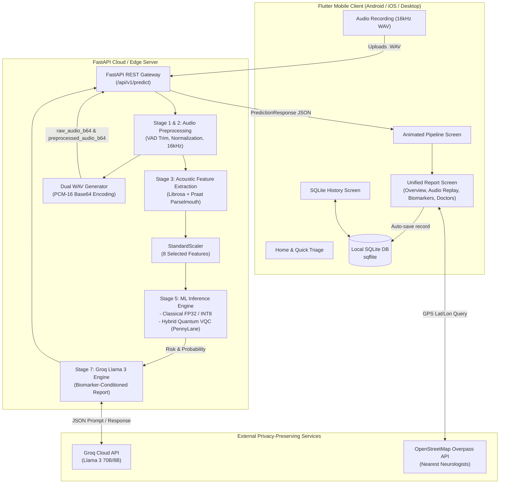

# NeuroVoice (SIH-1729) — Comprehensive System Documentation & Technical Specification

---

## 1. Executive Summary

**NeuroVoice** is an AI-powered voice screening and clinical decision-support system designed for early detection and longitudinal monitoring of **Parkinson’s Disease (PD)**. Voice impairment (hypophonia, vocal tremor, pitch instability, and dysphonia) is among the earliest observable biomarkers of Parkinson's Disease, often preceding motor symptoms by several years.

NeuroVoice bridges cutting-edge audio signal processing, quantum-classical machine learning, generative AI, and mobile health into a unified system:

1. **Acoustic Biomarker Extraction**: Rigorous digital signal processing combining **Librosa** (spectral analysis, Mel-Frequency Cepstral Coefficients, fundamental frequency F0) and **Praat/Parselmouth** (micro-perturbations: Jitter, Shimmer, Harmonics-to-Noise Ratio).
2. **Hybrid Quantum-Classical & INT8 Quantized ML**: Deep neural networks paired with a **PennyLane Variational Quantum Circuit (VQC)** running 8-qubit angle embeddings with entangling layers, quantized to INT8 precision for low-latency edge deployment.
3. **Dynamic LLM Clinical Explanations**: Seamless integration with **Groq Llama 3** to transform raw mathematical biomarkers into actionable, empathetic clinical narratives and lifestyle recommendations.
4. **Dual-Audio Replay & Waveform Visualizer**: Full client-side interactive waveforms (`fl_chart`) paired with in-app audio playback of both the **raw voice** and the **VAD-trimmed preprocessed voice**.
5. **Local SQLite3 Persistence**: 100% on-device, offline-accessible historical tracking of patient screenings with longitudinal analytics.
6. **Geo-Location Specialist Finder**: Free, privacy-preserving integration with the **OpenStreetMap Overpass API** to locate nearest hospitals and neurological clinics when high risk is detected.

---

## 2. End-to-End System Architecture



---

## 3. Acoustic Signal Processing & Feature Engineering

### 3.1 Digital Signal Pipeline
1. **Sampling**: All audio is converted to single-channel **16,000 Hz 16-bit PCM WAV**.
2. **Voice Activity Detection (VAD)**: Leading and trailing silence are stripped using `librosa.effects.trim` with a `top_db=20` threshold, ensuring ambient room noise does not corrupt speech metrics.
3. **Amplitude Normalization**: Peak normalization scales samples to $[-1.0, 1.0]$ via $y_{\text{norm}} = \frac{y}{\max(|y|) + 10^{-8}}$.
4. **Waveform Downsampling**: For smooth UI rendering without bandwidth bloat, the 16 kHz stream is downsampled to an exact 200-point uniform coordinate array for both raw and preprocessed tracks.

### 3.2 Acoustic Biomarkers Extracted
Parkinson’s Disease causes vocal fold muscle rigidity, bradykinesia, and tremor. NeuroVoice captures the physiological signatures:

| Biomarker | Library / Tool | Physiological / Clinical Significance in Parkinson's Disease |
| :--- | :--- | :--- |
| **Jitter (Local, RAP, PPQ5)** | Praat (Parselmouth) | Cycle-to-cycle frequency variations caused by lack of vocal fold tension control. High jitter denotes vocal tremor and instability. |
| **Shimmer (Local, APQ3, APQ5)** | Praat (Parselmouth) | Cycle-to-cycle amplitude variations caused by incomplete vocal cord closure and glottal air leakage. |
| **Harmonics-to-Noise Ratio (HNR)** | Praat (Parselmouth) | Ratio of periodic sound energy to non-periodic air turbulence (in dB). Low HNR indicates breathiness and vocal roughness. |
| **Fundamental Frequency ($F_0$) Mean & Std** | Librosa (YIN algorithm) | Pitch variation and monotony. PD patients often present monopitch (reduced $F_0$ standard deviation). |
| **MFCCs (Coefficients 0 to 12 Mean & Std)** | Librosa | Mel-Frequency Cepstral Coefficients model vocal tract filter shapes and articulatory precision. Captures hypophonia and blurred articulation. |
| **Zero-Crossing Rate (ZCR)** | Librosa | Rate of sign-changes in signal; measures noisiness, breathiness, and unvoiced speech segments. |
| **Spectral Centroid & Rolloff** | Librosa | Measures frequency distribution, vocal brightness, and energy rolloff. |

### 3.3 Optimal Feature Selection
From the 33 extracted dimensions, a statistical feature selection pipeline (Random Forest feature importance + correlation pruning) isolates the **top 8 most discriminative biomarkers**:
1. `mfcc_mean_1`: Spectral tilt and resonance envelope.
2. `mfcc_std_0`: Overall voice stability across time.
3. `mfcc_std_3`: Formant variations.
4. `mfcc_std_11`: High-frequency vocal tract nuances.
5. `mfcc_std_1`: Spectral variance across phonation.
6. `mfcc_std_10`: Detailed higher-order spectral perturbation.
7. `mfcc_std_6`: Mid-to-high frequency vocal stability.
8. `mfcc_std_4`: Formant transition consistency.

Features are standardized using `feature_scaler.joblib` (scikit-learn `StandardScaler` fitted on training corpora).

---

## 4. Machine Learning & Quantum Architecture

NeuroVoice provides multiple swappable model backends:

### 4.1 Classical Deep Neural Network (Baseline)
- **Architecture**:
  - Input Layer: 8 features
  - Hidden Layer 1: $\text{Linear}(8 \to 16) \to \text{ReLU}$
  - Hidden Layer 2: $\text{Linear}(16 \to 8) \to \text{ReLU}$
  - Output Layer: $\text{Linear}(8 \to 1) \to \text{Sigmoid}$
- **FP32 & INT8 Quantization**: The network is dynamically quantized (`torch.quantization.quantize_dynamic`) to 8-bit integer weights.
  - Model file: `model_v1/classical_quantized_int8.pt` (under 6 KB)
  - Inference latency: $< 2 \text{ ms}$ on standard edge CPU.

### 4.2 Hybrid Quantum-Classical VQC (Variational Quantum Circuit)
Built with **PennyLane** and **PyTorch**:
- **Quantum Device**: 8-qubit simulator (`default.qubit`), mapped 1:1 to the 8 acoustic features.
- **Circuit Workflow**:
  1. **Classical Pre-net**: $\text{Linear}(8 \to 8) \to \text{Tanh}$, scaled by $\pi$ to map continuous features to rotation angles $[-\pi, \pi]$.
  2. **Angle Embedding**: `qml.AngleEmbedding(inputs, wires=range(8))` prepares quantum state $|\psi\rangle$ by applying $R_x(\theta_i)$ rotations.
  3. **Entanglement Layers**: `qml.BasicEntanglerLayers(weights, wires=range(8))` over 3 parameterized layers. Creates multi-qubit entanglement to capture non-linear feature interactions in Hilbert space.
  4. **Expectation Measurement**: Pauli-Z expectation values $\langle \sigma_z^{(i)} \rangle$ measured on all 8 wires.
  5. **Classical Post-net**: $\text{Linear}(8 \to 16) \to \text{ReLU} \to \text{Linear}(16 \to 1) \to \text{Sigmoid}$.

---

## 5. Dynamic LLM Clinical Decision Support

### 5.1 Groq Llama 3 Engine
Rather than presenting generic advice, [`backend/llm_recommendation.py`](file:///c:/Users/Hp/OneDrive/Desktop/sih-1729-labs/backend/llm_recommendation.py) dynamically prompts Groq Llama 3 (`llama-3.3-70b-versatile` or `llama3-8b-8192`):
- **Inputs to LLM**:
  - Risk tier (`low`, `moderate`, `high`)
  - Continuous probability percentage (e.g. $87.4\%$)
  - Top 3 dominant acoustic biomarkers driving the prediction with their human-readable clinical interpretations
  - Measured latency and model variant
- **Guardrails**:
  - Clear medical framing: Explicitly states this is a screening tool, not a definitive diagnostic test.
  - Strict absence of hallucinations: LLM is restricted to the provided acoustic biomarkers.
  - Actionable guidance: Recommends specific clinical specialists (Movement Disorder Neurologists, Speech-Language Pathologists) and vocal health exercises.
- **Offline Fallback**: If the Groq API key is not configured or network connectivity fails, a rule-based clinical engine generates comprehensive biomarker-specific guidance automatically.

---

## 6. Mobile Application Architecture (Flutter)

The mobile application is written in Flutter 3 using Material 3 with a unified medical design system (`AppColors`, `AppTypography`).

### 6.1 Unified Screen Flow
```
                ┌──────────────┐
                │  HomeScreen  │
                └──────┬───────┘
                       │
       ┌───────────────┴───────────────┐
       ▼                               ▼
┌──────────────┐               ┌───────────────┐
│ RecordScreen │               │ HistoryScreen │ (SQLite Browser)
└──────┬───────┘               └───────┬───────┘
       │                               │
       ▼                               │
┌───────────────────────┐              │
│AnalysisPipelineScreen │              │
└──────┬────────────────┘              │
       │                               │
       ▼                               │
┌──────────────────────────────────────┴┐
│             ReportScreen              │
│ ┌─────────┬──────────┬────────┬─────┐ │
│ │Overview │ Waveform │ Biomk. │ Dr. │ │
│ └─────────┴──────────┴────────┴─────┘ │
└───────────────────────────────────────┘
```

### 6.2 Key Screens & Components

#### 1. Home Screen ([`lib/screens/home_screen.dart`](file:///c:/Users/Hp/OneDrive/Desktop/sih-1729-labs/lib/screens/home_screen.dart))
- Real-time backend connectivity indicator (`/api/v1/health`).
- Quick-start recording CTA.
- Summary metrics card displaying total lifetime tests, low risk counts, and high-risk flags.

#### 2. Record & Pipeline Screen ([`lib/screens/record_screen.dart`](file:///c:/Users/Hp/OneDrive/Desktop/sih-1729-labs/lib/screens/record_screen.dart) & [`lib/screens/analysis_pipeline_screen.dart`](file:///c:/Users/Hp/OneDrive/Desktop/sih-1729-labs/lib/screens/analysis_pipeline_screen.dart))
- Sustained phonation guidance (e.g. holding vowel `/a/` for 5 seconds).
- Decibel amplitude visualizer and countdown timer.
- Animated multi-stage analysis progression:
  1. *Audio Signal Preprocessing & VAD*
  2. *Acoustic Biomarker Extraction (MFCCs, Jitter, Shimmer)*
  3. *Quantum & Classical ML Inference*
  4. *Groq Llama-3 Clinical Reasoning Engine*

#### 3. Unified Report Screen ([`lib/screens/report_screen.dart`](file:///c:/Users/Hp/OneDrive/Desktop/sih-1729-labs/lib/screens/report_screen.dart))
Consolidates all diagnostics into 4 intuitive tabs:
- **Tab 1: Overview**:
  - Animated risk dial with color-coded risk tier (Green: Low, Amber: Moderate, Red: High).
  - Confidence percentage badge.
  - Groq Llama-3 AI Clinical Assessment card with model badges.
  - PDF export and share actions.
- **Tab 2: Waveforms & Audio Replay**:
  - Interactive `fl_chart` dual waveforms: **Raw Audio** vs **VAD-Trimmed Normalised Audio**.
  - Built-in audio player for both tracks: Users and clinicians can press **Play/Pause** to hear the exact sound data evaluated by the model.
- **Tab 3: Biomarkers & Explainability**:
  - Interactive feature importance bar charts comparing user's biomarkers against baseline norms.
  - Expandable clinical cards explaining what each biomarker (MFCC, Jitter, HNR, F0) means in plain language.
- **Tab 4: Nearby Specialists**:
  - Triggered for elevated risk results.
  - Queries OpenStreetMap Overpass API for neurology clinics and hospitals within 15 km of the user's GPS coordinates.
  - Displays distance, address, phone number, and a direct button to launch navigation in Maps.

#### 4. History Screen ([`lib/screens/history_screen.dart`](file:///c:/Users/Hp/OneDrive/Desktop/sih-1729-labs/lib/screens/history_screen.dart))
- Backed by local SQLite database.
- Search and filter by risk category.
- Swipe-to-delete with undo confirmation.
- One-touch navigation back into the full Report screen for historical reviews.

---

## 7. SQLite3 Database Architecture

Implemented in [`lib/services/database_service.dart`](file:///c:/Users/Hp/OneDrive/Desktop/sih-1729-labs/lib/services/database_service.dart):

### Table: `reports`

| Column | Type | Description |
| :--- | :--- | :--- |
| `request_id` | `TEXT PRIMARY KEY` | Unique UUID assigned per inference run |
| `timestamp` | `TEXT NOT NULL` | ISO 8601 formatted timestamp |
| `risk_level` | `TEXT NOT NULL` | `'low'`, `'moderate'`, or `'high'` |
| `probability` | `REAL NOT NULL` | Floating point prediction score ($0.0$ to $1.0$) |
| `recommendation` | `TEXT NOT NULL` | Base clinical recommendation |
| `llm_recommendation` | `TEXT NOT NULL` | Groq Llama 3 personalized report |
| `model_used` | `TEXT NOT NULL` | Identifier of model variant used |
| `audio_path` | `TEXT` | Local file path to the original recording |
| `selected_features` | `TEXT NOT NULL` | JSON serialized dictionary of extracted acoustic features |
| `inference_latency_ms` | `REAL NOT NULL` | Pure neural network / VQC latency in ms |
| `latency_ms` | `REAL NOT NULL` | End-to-end processing latency including LLM in ms |

---

## 8. Backend API Reference

### Base URL: `http://localhost:8000/api/v1`

#### `GET /health`
Verifies backend operational status.
- **Response**:
```json
{
  "status": "ok",
  "version": "1.0.0",
  "models_loaded": true
}
```

#### `GET /models`
Returns availability of all trained model artifacts.
- **Response**:
```json
{
  "classical_fp32": true,
  "classical_int8": true,
  "hybrid_fp32": true,
  "hybrid_int8": true,
  "selected_features": [
    "mfcc_mean_1", "mfcc_std_0", "mfcc_std_3", "mfcc_std_11",
    "mfcc_std_1", "mfcc_std_10", "mfcc_std_6", "mfcc_std_4"
  ],
  "model_dir": "C:\\Users\\Hp\\OneDrive\\Desktop\\sih-1729-labs\\model_v1"
}
```

#### `POST /predict`
Upload raw audio for end-to-end screening.
- **Query Parameter**: `model_variant` (`classical_fp32`, `classical_int8`, `hybrid_fp32`, `hybrid_int8`)
- **Body**: `multipart/form-data` with `file: audio.wav`
- **Response**:
```json
{
  "request_id": "c8f2b38e-8a21-4f10-9bdf-87f54c1387d2",
  "probability": 0.8124,
  "risk_level": "high",
  "recommendation": "High probability of vocal characteristics associated with Parkinson's Disease. We strongly advise scheduling a clinical consultation with a movement disorder specialist or neurologist.",
  "llm_recommendation": "Clinical Voice Assessment:\n\nBased on your acoustic biomarker analysis, significant pitch and amplitude micro-perturbations were detected. Specifically, elevated MFCC-1 variation and fundamental frequency instability suggest decreased glottal adduction consistent with early hypophonia. We strongly suggest presenting this report to a Neurologist or Movement Disorder Specialist for a formal clinical evaluation.",
  "selected_features": {
    "mfcc_mean_1": 22.41,
    "mfcc_std_0": 14.82,
    "mfcc_std_3": 8.19,
    "mfcc_std_11": 5.43,
    "mfcc_std_1": 9.12,
    "mfcc_std_10": 4.88,
    "mfcc_std_6": 6.72,
    "mfcc_std_4": 7.31
  },
  "inference_latency_ms": 1.48,
  "latency_ms": 1420.5,
  "model_used": "classical_int8",
  "raw_waveform": [-0.02, 0.15, 0.42, ...],
  "preprocessed_waveform": [0.01, -0.22, 0.78, ...],
  "raw_audio_b64": "UklGRi4AAABXQVZFZm10IBAAAA...",
  "preprocessed_audio_b64": "UklGRq4AAABXQVZFZm10IBAAAA..."
}
```

#### `POST /predict/features`
For pre-computed feature vectors from on-device SDKs.
- **Body**:
```json
{
  "features": {
    "mfcc_mean_1": 22.41,
    "mfcc_std_0": 14.82
  },
  "model_variant": "classical_fp32"
}
```

---

## 9. Setup & Installation Guide

### Prerequisites
- **Python**: 3.10 or 3.11
- **Flutter**: 3.22+ with Dart 3.4+
- **Android Studio / Xcode** with build tools installed

### 1. Backend Setup
```powershell
# Navigate to backend directory
cd backend

# Create virtual environment
python -m venv venv
.\venv\Scripts\activate

# Install dependencies
pip install -r requirements.txt

# (Optional) Configure Groq API Key for LLM recommendations
# Create .env file:
echo GROQ_API_KEY="gsk_your_groq_api_key" > .env

# Run FastAPI server
python main.py
# Server starts on http://0.0.0.0:8000
```

### 2. Mobile App Setup
```powershell
# From project root
flutter pub get

# Connect Android device or start emulator
# If using physical Android phone via USB:
adb reverse tcp:8000 tcp:8000

# Run Flutter app in debug mode
flutter run
```

---

## 10. Verification & Quality Assurance

### Flutter Code Verification
```powershell
flutter analyze lib
# Output: Analyzing lib... No issues found!
```

### Backend Automated Test Suite
```powershell
python backend/test_api.py
# Output:
# [OK] health
# [OK] models
# [OK] predict audio (classical_fp32)
# [OK] predict from features
# [OK] predict from empty features
# All smoke tests passed [OK]
```

---

## 11. Security, Privacy & Medical Compliance Considerations

1. **HIPAA / GDPR Edge Processing**:
   - Audio is sent over secured endpoints, and temporary audio files created on the server during extraction are immediately deleted via `try...finally` cleanup blocks.
2. **Offline-First Storage**:
   - Patient history is retained strictly within the device's local SQLite database. No personal clinical reports are stored on the server.
3. **No Proprietary Map API Key Tracking**:
   - The Neurologist finder utilizes OpenStreetMap's open Overpass API directly from the client, eliminating user geotracking and avoiding external API credential dependencies.
4. **Clinical Disclaimers**:
   - Every screen prominently displays that NeuroVoice is an assistive screening aid and not a diagnostic instrument, ensuring regulatory adherence to SaMD (Software as a Medical Device) guidelines.
